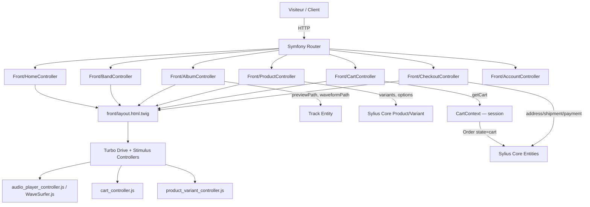

# Requirements

## Overview & Goals

Mettre en place la partie **front boutique** (côté visiteur/client) de l'**Indie Label Shop**, une plateforme e-commerce pour labels indépendants. Le back est complet (Symfony 7.4, Sylius Core 2.2, entités musicales et e-commerce). L'objectif est de créer une expérience utilisateur soignée qui valorise le catalogue musical (artistes, albums, tracklists, previews audio) et implémente un tunnel d'achat custom s'appuyant uniquement sur le cœur Sylius (`sylius/core`).

---

## Scope

### In Scope
- **Accueil** : mise en avant éditoriale (nouveautés, artistes, albums en vedette)
- **Catalogue musical** : listing albums/releases avec filtres
- **Page Artiste (Band)** : biographie, membres, réseaux sociaux, discographie
- **Page Album** : artwork, tracklist avec lecteur de preview audio (waveform), releases physiques liées
- **Boutique Merch** : listing produits, fiche produit (options/variants Sylius)
- **Panier & Checkout** : tunnel d'achat custom (panier, adresses, livraison, paiement) basé sur les entités Sylius Core (`Order`, `OrderItem`, `Shipment`, `Payment`)
- **Compte client** : inscription, connexion, historique commandes
- **Composants transversaux** : header, footer, navigation, breadcrumb, pagination

### Out of Scope
- Interface d'administration (déjà réalisée via Aropixel Admin Bundle)
- Encodage audio / gestion des fichiers masters (déjà géré côté back)
- SyliusShopBundle et ses routes/templates (non installé)

---

## User Stories

 ID | En tant que... | Je veux... | Pour... |
----|---------------|-----------|--------|
 US-01 | Visiteur | Découvrir les nouveaux albums sur la page d'accueil | Rester informé des sorties du label |
 US-02 | Visiteur | Naviguer vers la page d'un artiste | Découvrir sa bio, ses membres et sa discographie |
 US-03 | Visiteur | Écouter un extrait de chaque titre sur la page album | Décider d'acheter avant d'écouter |
 US-04 | Visiteur | Voir la tracklist d'un album avec la waveform de chaque titre | Explorer visuellement le contenu |
 US-05 | Client | Ajouter un article merch ou un album au panier | Effectuer un achat |
 US-06 | Client | Finaliser une commande (adresse, livraison, paiement) | Recevoir ma commande |
 US-07 | Client | Me connecter et consulter mes commandes passées | Suivre mes achats |
 US-08 | Visiteur | Changer la langue du site (FR/EN) depuis le header | Naviguer dans sa langue
 US-09 | Client | Télécharger un album acheté au format MP3 320kbps, WAV ou ZIP | Obtenir les fichiers dans le format de mon choix
 US-10 | Client | Voir la progression de la préparation du téléchargement | Savoir que le fichier est en cours de génération
 US-11 | Client | Reprendre un téléchargement interrompu dans les 24h | Ne pas avoir à relancer la génération
 US-12 | Client | Recevoir un email de confirmation après un achat | Avoir la preuve de commande et un récapitulatif avec facture PDF
 US-13 | Client | Recevoir un email quand mes fichiers numériques sont prêts | Télécharger sans avoir à surveiller mon espace compte

---

## Functional Requirements

### Page d'accueil
- Section "Dernières sorties" (Albums avec `status = online`, triés par `releaseDate` desc)
- Section "Artistes" (carousel ou grille de Bands en ligne)
- Bandeau ou hero éditorial (configurable)

### Catalogue Albums
- Grille/liste d'albums avec artwork, titre, artiste, date de sortie
- Filtre par artiste (Band)
- Pagination (Pagerfanta déjà en dépendance)

### Page Album
- Artwork, titre, numéro de catalogue, date de sortie, description
- Tracklist avec pour chaque piste : titre, durée, lecteur waveform (WaveSurfer.js) si `previewPath` disponible
- Releases physiques liées (vinyl, CD…) avec bouton "Ajouter au panier"
- Albums similaires

### Page Artiste (Band)
- Photo, nom, description
- Réseaux sociaux (Facebook, Twitter, Instagram, Website)
- Membres (Artists)
- Discographie (Albums liés)

### Boutique Merch
- Listing des `Product` de type merch
- Fiche produit : images, description, sélection d'options/variants (taille, couleur…), ajout au panier

### Panier & Checkout
- Résumé du panier (items, quantités, prix)
- Tunnel checkout custom en plusieurs étapes : adresse de livraison, méthode de livraison, paiement
- Page de confirmation de commande
- **Pas de SyliusShopBundle** : tous les controllers, formulaires et templates sont implémentés manuellement

### Paiement (Stripe & PayPal)

Deux moyens de paiement sont supportés, configurables via l'admin (CRUD `PaymentMethod` déjà en place). Le choix du gateway est piloté par `PaymentMethod.gatewayType` (`"stripe"` ou `"paypal"`), les clés API sont stockées dans `PaymentMethod.credentials` (JSON).

**Stripe (Card Elements)**
- L'étape paiement du checkout charge **Stripe.js** et monte un **Stripe Elements** (formulaire de carte intégré, PCI-compliant)
- Flux serveur : `CheckoutController::payment()` crée un `PaymentIntent` Stripe via `StripeGateway` et retourne le `clientSecret` au template
- Flux client : le Stimulus controller `stripe_payment_controller.js` confirme le PaymentIntent avec `stripe.confirmCardPayment(clientSecret)`
- En cas de succès Stripe, un appel AJAX notifie `CheckoutController::paymentConfirm()` qui fait passer l'`Order` en état `fulfilled`
- **Webhook** `POST /webhook/stripe` : reçoit les événements Stripe asynchrones (`payment_intent.succeeded`, `payment_intent.payment_failed`) et met à jour l'état du `Payment` Sylius ; vérification de la signature via `Stripe-Signature` + `STRIPE_WEBHOOK_SECRET`

**PayPal (Smart Buttons)**
- L'étape paiement charge le **PayPal JS SDK** et affiche les Smart Buttons
- Flux serveur : au clic "PayPal", `CheckoutController::paypalCreateOrder()` crée une commande PayPal via `PaypalGateway` et retourne l'`orderId`
- Flux client : le Stimulus controller `paypal_payment_controller.js` ouvre la popup PayPal ; à l'approbation, appelle `CheckoutController::paypalCaptureOrder()` qui capture le paiement et fait passer l'`Order` en `fulfilled`
- **Webhook** `POST /webhook/paypal` : reçoit les événements PayPal asynchrones (`PAYMENT.CAPTURE.COMPLETED`, `PAYMENT.CAPTURE.DENIED`) ; vérification via l'API PayPal (`paypal/checkout-sdk-php`)

**Infrastructure commune**
- `PaymentGatewayInterface` : contrat commun (`createIntent`, `capture`, `refund`)
- `PaymentProcessor` : orchestrateur appelé par le checkout, résout le bon gateway selon `PaymentMethod.gatewayType`, met à jour l'état Sylius (`Payment::STATE_*`)
- Les clés API (publishable key, secret, client id…) sont lues depuis `PaymentMethod.credentials` — pas de variables d'environnement pour les clés métier ; seuls `STRIPE_WEBHOOK_SECRET` et `PAYPAL_WEBHOOK_ID` sont en `.env` (ne pas les stocker en base)

### Compte client
- Pages de connexion / inscription
- Dashboard : historique des commandes, détail d'une commande avec accès aux téléchargements numériques disponibles

### Téléchargement de fichiers numériques (post-achat)

Lorsqu'une commande contient un `OrderItem` digital (album ou release), le client peut télécharger ses fichiers depuis son espace compte ou depuis la page de confirmation. Le workflow est **asynchrone** : la génération s'effectue à la demande en tâche de fond.

**Sélection du format**
- Sur la page de son compte (détail commande), le client choisit le format avant de lancer le téléchargement : **MP3 320 kbps**, **WAV** (depuis FLAC, sans ré-encodage), ou **ZIP** (album entier dans le format choisi)
- Le choix est mémorisé dans le `DownloadToken` associé à chaque `OrderItem` + format

**Génération à la demande (on-the-fly)**
- Aucun fichier de vente n'est stocké de manière permanente — seuls les masters FLAC persistent dans `private.storage`
- À la demande de téléchargement, un `GenerateDownloadMessage` est dispatché via Symfony Messenger (transport `async` déjà configuré)
- Le handler lit le master FLAC via stream Flysystem (`private.storage`) → transcodage FFmpeg en RAM → écriture dans `private.storage` sous le préfixe `temp-downloads/{order_id}/{format}/{filename}` (même disque, sous-répertoire dédié)
- Formats : MP3 CBR 320 kbps (FFmpeg — différent des previews à 128 kbps), WAV (FFmpeg copy PCM depuis FLAC), ZIP (archive des pistes du même format)

**Stockage éphémère & accès au fichier généré**

Les fichiers générés sont écrits dans `private.storage` — disque défini par `aropixel/admin-bundle` via `prepend()`, son adaptateur varie selon l'environnement :

- **Développement** : adaptateur `local` → `%kernel.project_dir%/private/` ; les fichiers générés se retrouvent dans `private/temp-downloads/{order_id}/` ; l'accès se fait via une **route Symfony dédiée** `GET /download/file/{token}` qui sert le fichier depuis le filesystem — pas d'URL présignée en local
- **Production** : adaptateur `asyncaws` → bucket Cellar (Clever Cloud, S3-compatible), préfixe `private` ; l'accès se fait via **URL présignée S3** (validité 24 heures) ; une règle de lifecycle S3 sur le préfixe `private/temp-downloads/` supprime automatiquement les objets après 1 jour (configuration côté console Clever Cloud, hors code applicatif)
- `DownloadTokenManager` détecte le mode via `%kernel.environment%` et retourne l'URL appropriée : route interne en dev, URL présignée S3 en prod
- Si le fichier existe encore (regénération dans les 24h), `prepare` retourne directement l'URL sans redispatch Messenger

**UX asynchrone (polling)**
1. Le client clique "Télécharger" → `POST /download/prepare` → HTTP 202, `DownloadToken` créé/retourné
2. Le Stimulus controller `download_controller.js` interroge `GET /download/status/{token}` toutes les 2 secondes
3. Quand le statut passe à `ready`, le controller déclenche le téléchargement via l'URL retournée (présignée S3 en prod, route interne en dev)
4. États possibles du token : `pending` (job en attente), `processing` (encodage en cours), `ready` (URL disponible), `failed` (erreur FFmpeg)

---

### Emails post-achat

Les emails transactionnels sont envoyés de façon **asynchrone** via Symfony Messenger (même transport `async` que les encodages) pour ne pas bloquer la réponse HTTP.

**Emails envoyés**

| Email | Déclencheur | Contenu |
|-------|-------------|---------|
| Confirmation de commande | `PaymentProcessor::complete()` → dispatch `SendOrderConfirmedMessage` | Récapitulatif items/prix, adresse de livraison, lien espace compte, **facture PDF** en pièce jointe. Pour commandes digitales : mention "Vos téléchargements sont disponibles dans votre espace client." |
| Fichiers numériques prêts | `GenerateDownloadHandler` → dispatch `SendDownloadReadyMessage` quand `DownloadToken::status = ready` | Lien signé S3 (validité 24h), date d'expiration, lien vers l'espace compte en secours |
| Confirmation d'expédition | Action admin (saisie du numéro de suivi) — hors scope frontend, documenté pour cohérence | Numéro de suivi, transporteur, lien de tracking externe |

**Stack technique**
- **Symfony Mailer** (natif Symfony 7.4) — pas de SyliusMailerBundle
- Templates Twig HTML + texte plain (`emails/order_confirmed.html.twig` / `.txt.twig`)
- **Facture PDF** via `dompdf/dompdf` (aucune dépendance système contrairement à wkhtmltopdf)
- `OrderMailer` service unique : point d'entrée pour tous les envois, reçoit `MailerInterface` en injection
- Les messages Messenger `SendOrderConfirmedMessage` et `SendDownloadReadyMessage` sont routés vers le transport `async`

---

### Multilingue

Le front supporte le multilingue de façon **conditionnelle** : le comportement s'adapte automatiquement au nombre de locales configurées dans `app.locales`, afin que les labels clonant le projet n'aient pas de contrainte d'URL inutile s'ils n'utilisent qu'une seule langue.

- **Mode multi-locales** (`count(app.locales) > 1`) : toutes les routes front sont préfixées par `/{_locale}` (ex. `/fr/albums`, `/en/albums`) ; `/` redirige vers `/{locale_par_defaut}` ; un sélecteur de langue apparaît dans le header
- **Mode mono-locale** (`count(app.locales) == 1`) : aucun préfixe dans les URLs (`/albums`, `/boutique`…) ; la locale est forcée à la valeur unique configurée via un `LocaleSubscriber` sur `kernel.request` ; le sélecteur de langue est absent du header
- **Implémentation du routage conditionnel** : un `FrontRouteLoader` custom (service Symfony) lit `%app.locales%` au boot et génère programmatiquement les routes front — avec préfixe `/{_locale}` et requirement `[a-z]{2}` en mode multi, sans préfixe en mode mono. Les controllers n'ont pas de préfixe locale dans leurs attributs `#[Route]`
- **Chaînes d'interface** : tous les libellés statiques passent par Symfony Translator (`{{ 'front.cart.add'|trans }}`), catalogues YAML dans `translations/messages+intl-icu.{locale}.yaml`
- **Contenu dynamique** :
  - `Band.description` / `Album.description` : traduits via **DoctrineExtensions (Gedmo)** — `$entity->setTranslatableLocale($request->getLocale()); $em->refresh($entity)`
  - `Product.name/slug/description`, `ShippingMethod.name` : traduits via le **pattern Sylius Resource** (`getTranslation()`) ; locale positionnée par `SyliusTranslatableSubscriber`
- **Slugs** : non traduits (un seul slug par entité) ; la locale n'apparaît que dans le préfixe d'URL (mode multi)
- **SEO multilingue** (mode multi uniquement) : balises `<link rel="alternate" hreflang>` dans `<head>` générées en Twig

---

## Non-Functional Requirements
- **Performance** : lazy loading des images (artwork, photos artiste), chargement différé des lecteurs audio
- **Responsive** : mobile-first, compatible desktop/tablette
- **Accessibilité** : balises sémantiques HTML5, `aria-label` sur les contrôles audio
- **SEO** : balises `<title>`, `<meta description>`, URLs propres via les slugs existants, balises `hreflang` pour le multilingue


# Technical Design

## Current Implementation

Le backend est complet :
- **Entités musicales** : `Band`, `Album`, `Release`, `Track`, `Tracklist`, `Artist` avec slugs, statuts (`online`/`offline`), images croppées, traductions Doctrine
- **Entités Sylius Core** : `Product` (merch + album via héritage discriminé), `ProductVariant`, `Order`, `OrderItem`, `Payment`, `Shipment`, `ShippingMethod`, `PaymentMethod`, `Customer` — issues de `sylius/core` uniquement, **SyliusShopBundle non installé**
- **PaymentMethod** : entité étendue avec `gatewayType` (`"stripe"` / `"paypal"`) et `credentials` (JSON — clés API, mode sandbox/live) ; admin CRUD complet avec Stimulus controller de toggle des champs de credentials
- **Track** : `previewPath` et `waveformPath` générés par l'encodeur async Messenger (128 kbps preview + waveform PNG) ; master FLAC accessible via Flysystem `private.storage` en production
- **Encodeur existant** (`src/Component/Track/`) : `EncodeTrackMp3Message` → `EncodeTrackMp3Handler` ; utilise `php-ffmpeg/php-ffmpeg` ; écrit sur `previews.storage` ; génère actuellement un PNG de waveform (à remplacer par **JSON peaks WaveSurfer.js** — Step 3) ; **la pipeline de vente (320 kbps, WAV, ZIP) est entièrement à créer**
- **Messenger** : transport `async` (Doctrine) + transport `failed` configurés ; routing `EncodeTrackMp3Message` → `async` en place ; prêt à accueillir `GenerateDownloadMessage`
- **Flysystem** : 3 disques en production (`private.storage`, `public.storage`, `previews.storage`) tous sur le bucket Cellar (Clever Cloud, S3-compatible via AsyncAws)
- **Stack front existant** : Twig, Stimulus 3, Turbo 7, Asset Mapper — aucune page publique développée
- **Templates** : seul `base.html.twig` (vide) et les templates `admin/` existent
- **Assets** : `assets/app.js` et `assets/app.css` vides à exploiter
- **Pas de routes shop Sylius** : le tunnel panier/checkout est entièrement custom

---

## Key Decisions

 Décision | Choix | Rationale |
---------|-------|----------|
 Framework CSS | **Tailwind CSS** via `importmap:require` | Utility-first, compatible Asset Mapper, pas de build step |
 Interactivité | **Stimulus 3** (déjà en place) | Contrôleurs légers sur les composants dynamiques |
 Navigation SPA-like | **Turbo Drive** (déjà en place) | Transitions fluides sans rechargement complet |
 Lecteur audio | **WaveSurfer.js** via importmap | Valorise `waveformPath` (JSON peaks) déjà généré |
 Layout des templates | **Twig inheritance** à 3 niveaux : `base.html.twig` → `front/layout.html.twig` → page | Pattern standard Symfony |
 Routage | Contrôleurs Symfony dans `src/Controller/Front/` | Symétrie avec `src/Controller/Admin/` déjà en place |
 Panier/Checkout | Implémentation custom via les entités Sylius Core (`Order`, `OrderItem`, etc.) | SyliusShopBundle non installé — tout est à implémenter |
 Gestion panier | L'`Order` (state=`cart`) est **persisté en base dès sa création** ; la session ne stocke que le `tokenValue` (UUID). Nettoyage via une commande custom `app:cart:purge-expired` (cron quotidien, TTL configurable). | Cohérent avec le modèle Sylius natif ; ouvre la voie aux relances de paniers abandonnés sans infrastructure supplémentaire |
 Paiement Stripe | **Stripe Elements** (card form intégré) + `PaymentIntent` côté serveur | PCI-compliant sans redirection ; UX fluide ; clés API en base via admin |
 Paiement PayPal | **PayPal Smart Buttons** (JS SDK) + create/capture order côté serveur | Pas de redirection hors site ; flux familier pour l'acheteur |
 Gateway abstraction | `PaymentGatewayInterface` + `StripeGateway` / `PaypalGateway` | Isolation du code gateway ; facilite l'ajout d'un 3e moyen de paiement |
 Webhooks paiement | `Front/WebhookController.php` avec vérification de signature | Sécurité des callbacks async ; mise à jour fiable de l'état Sylius `Payment` |
 Clés API paiement | Stockées en base dans `PaymentMethod.credentials` (JSON) ; seuls `STRIPE_WEBHOOK_SECRET` et `PAYPAL_WEBHOOK_ID` en `.env` | Configurable par label sans redéploiement ; webhook secrets hors base par sécurité |
 Téléchargement — génération | On-the-fly : stream FLAC depuis S3 → FFmpeg en RAM → écriture S3 via Symfony Messenger | Aucun stockage permanent des fichiers de vente ; coût minimal |
 Téléchargement — formats | MP3 320 kbps (CBR), WAV (copy PCM), ZIP album | MP3 = standard streaming ; WAV = qualité lossless ; ZIP = commodité |
 Téléchargement — accès fichier | URL présignée S3 (24h) via AsyncAws S3 `presign()` | Accès sécurisé sans exposer le bucket ; durée suffisante pour download resuming |
 Téléchargement — nettoyage | Lifecycle S3 sur préfixe `temp-downloads/` (1 jour) configuré côté Clever Cloud | Suppression automatique par l'infra, pas de cron applicatif à maintenir |
 Téléchargement — UX async | Polling côté client via Stimulus `download_controller.js` (toutes les 2s) | Simple à implémenter ; pas de WebSocket à provisionner |
 Emails transactionnels | Symfony Mailer natif + `OrderMailer` service ; envoi async via Messenger (`async`) ; PDF facture via `dompdf/dompdf` | Pas de SyliusMailerBundle ; pas de latence HTTP ; dompdf = zéro dépendance système |
 Email confirmation — déclencheur | `PaymentProcessor::complete()` dispatche `SendOrderConfirmedMessage` | Envoi garanti après capture paiement ; idempotent (un seul email même en cas de retry Messenger) |
 Email download ready — déclencheur | `GenerateDownloadHandler` dispatche `SendDownloadReadyMessage` après `DownloadToken::status = ready` | L'email part exactement quand le lien est disponible, pas depuis le polling client |
 Multilingue — routage conditionnel | `FrontRouteLoader` custom lit `%app.locales%` ; préfixe `/{_locale}` seulement si plusieurs locales | Les URLs restent propres pour les labels mono-langue ; pas de duplication de routes dans les controllers |
 Multilingue — mono-locale | `LocaleSubscriber` force la locale unique sur `kernel.request` | Aucun préfixe dans les URLs, comportement transparent pour le label mono-langue |
 Multilingue — propagation locale | `SyliusTranslatableSubscriber` existant (écoute `postLoad`/`prePersist`) | Positionne automatiquement `currentLocale`/`fallbackLocale` sur les entités Sylius translatable |
 Multilingue — entités Gedmo | `setTranslatableLocale()` + `EntityManager::refresh()` dans les controllers | Nécessaire pour Band et Album qui utilisent DoctrineExtensions au lieu du pattern Sylius |
 Multilingue — chaînes statiques | Fichiers YAML `translations/messages+intl-icu.{locale}.yaml` | Standard Symfony, compatible ICU pour pluriels et formatage |

---

## Proposed Changes

### Nouveaux Controllers (`src/Controller/Front/`)
```
Front/HomeController.php          — Page d'accueil
Front/BandController.php          — Listing + page artiste
Front/AlbumController.php         — Listing + page album
Front/ProductController.php       — Listing merch + fiche produit
Front/CartController.php          — Panier (affichage, ajout, suppression d'items)
Front/CheckoutController.php      — Tunnel d'achat (adresse, livraison, paiement, confirmation)
                                    + paypalCreateOrder(), paypalCaptureOrder() (appels AJAX PayPal)
                                    + paymentConfirm() (confirmation Stripe post-Elements)
Front/WebhookController.php       — POST /webhook/stripe et POST /webhook/paypal
Front/DownloadController.php      — POST /download/prepare, GET /download/status/{token}
Front/AccountController.php       — Connexion, inscription, compte client
```

### Services custom à créer (`src/`)
```
Component/Cart/CartContext.php                  — Récupération/création de l'Order courant (session)
Component/Cart/CartManager.php                 — Ajout/retrait d'items, recalcul totaux
Routing/FrontRouteLoader.php                 — Route loader conditionnel (préfixe /{_locale} si multi-locales)
EventListener/LocaleSubscriber.php           — Force la locale unique sur kernel.request (mode mono-locale)
Payment/Gateway/PaymentGatewayInterface.php  — Contrat commun : createIntent(), capture(), refund()
Payment/Gateway/StripeGateway.php            — Implémentation Stripe (stripe/stripe-php SDK)
Payment/Gateway/PaypalGateway.php            — Implémentation PayPal (paypal/checkout-sdk-php SDK)
Payment/PaymentProcessor.php                 — Résout le gateway selon PaymentMethod.gatewayType, met à jour Payment::state
Download/GenerateDownloadMessage.php         — Message Messenger : orderId, orderItemId, format (mp3|wav|zip)
Download/GenerateDownloadHandler.php         — Handler : stream FLAC S3 → FFmpeg → écriture S3 temp-downloads/ → met à jour DownloadToken
Download/DownloadTokenManager.php           — Crée/récupère DownloadToken, génère l'URL présignée S3 (24h)
Mail/OrderMailer.php                        — Point d'entrée unique : sendOrderConfirmed(), sendDownloadReady(), sendOrderShipped()
Mail/SendOrderConfirmedMessage.php          — Message Messenger : orderId
Mail/SendOrderConfirmedHandler.php          — Handler : construit l'email, génère le PDF facture (dompdf), envoie via MailerInterface
Mail/SendDownloadReadyMessage.php           — Message Messenger : downloadTokenId
Mail/SendDownloadReadyHandler.php           — Handler : récupère l'URL présignée, envoie l'email avec le lien
Form/Type/CheckoutAddressType.php            — Formulaire étape adresse
Form/Type/CheckoutShipmentType.php           — Formulaire étape livraison
Form/Type/CheckoutPaymentType.php            — Formulaire étape paiement
```

### Nouveaux Templates (`templates/front/`)
```
front/layout.html.twig                     — Layout principal (header, footer, nav)
front/partials/
  _header.html.twig
  _footer.html.twig
  _album_card.html.twig
  _band_card.html.twig
  _track_row.html.twig
front/home/index.html.twig
front/band/index.html.twig
front/band/show.html.twig
front/album/index.html.twig
front/album/show.html.twig
front/product/index.html.twig
front/product/show.html.twig
front/cart/index.html.twig
front/checkout/address.html.twig
front/checkout/shipment.html.twig
front/checkout/payment.html.twig
front/checkout/confirm.html.twig
front/account/login.html.twig
front/account/register.html.twig
front/account/dashboard.html.twig
front/account/order_show.html.twig      — inclut la section téléchargements avec sélecteur de format
front/partials/_download_item.html.twig — bouton download + indicateur de statut (pending/ready/failed)
emails/
  order_confirmed.html.twig            — Email confirmation commande (HTML)
  order_confirmed.txt.twig             — Email confirmation commande (texte plain)
  download_ready.html.twig             — Email "fichiers prêts" avec lien signé (HTML)
  download_ready.txt.twig              — Email "fichiers prêts" (texte plain)
  order_shipped.html.twig              — Email expédition avec numéro de suivi (HTML)
  order_shipped.txt.twig               — Email expédition (texte plain)
  pdf/invoice.html.twig                — Template HTML rendu en PDF (dompdf)
```

### Nouveaux Stimulus Controllers (`assets/controllers/`)
```
audio_player_controller.js      — WaveSurfer.js, lecture preview, waveform
cart_controller.js              — Ajout au panier (fetch API → CartController::add)
product_variant_controller.js   — Sélection de variant (taille, couleur…)
stripe_payment_controller.js    — Monte Stripe Elements, confirme PaymentIntent, soumet la commande
paypal_payment_controller.js    — Charge PayPal JS SDK, rend les Smart Buttons, gère create/capture
download_controller.js          — Déclenche /download/prepare, poll /download/status/{token} toutes les 2s, lance le téléchargement quand ready
```

### Nouveaux fichiers de traduction (`translations/`)
```
translations/messages+intl-icu.fr.yaml   — Chaînes statiques front en français
translations/messages+intl-icu.en.yaml   — Chaînes statiques front en anglais
```

### Nouvelle entité Doctrine (`src/Entity/`)
```
DownloadToken
  - id: int
  - orderItem: ManyToOne → OrderItem
  - format: string (enum : mp3|wav|zip)
  - status: string (enum : pending|processing|ready|failed)
  - s3Path: ?string          — chemin dans temp-downloads/ une fois généré
  - expiresAt: ?DateTimeImmutable — null tant que pending, 24h après génération
  - createdAt: DateTimeImmutable
```
Migration Doctrine à créer pour la table `download_token`.

### Nouvelles dépendances Composer
```
stripe/stripe-php                — SDK officiel Stripe (PHP)
paypal/checkout-sdk-php          — SDK officiel PayPal (PHP)
dompdf/dompdf                    — Génération de PDF (facture) depuis template Twig HTML — aucune dépendance système
```

### Mise à jour des Assets
- `assets/app.css` : import Tailwind + variables de thème (couleurs label)
- `assets/app.js` : registre des nouveaux contrôleurs Stimulus
- `importmap.php` : ajout de `tailwindcss`, `wavesurfer.js`, `@stripe/stripe-js`
  (PayPal JS SDK est chargé dynamiquement par `paypal_payment_controller.js` via `data-value` contenant le `client-id`)

### Variables d'environnement à ajouter (`.env`)
```
STRIPE_WEBHOOK_SECRET=   # Secret de validation de signature des webhooks Stripe
PAYPAL_WEBHOOK_ID=       # ID webhook PayPal pour la vérification des événements
```

---

## Data Models / Contracts

Les entités existantes sont exposées directement via les Controllers Symfony (pas d'API REST séparée).

```php
// FrontRouteLoader::load()
// → Charge les routes depuis les attributs #[Route] des controllers Front/
// → Si count($this->locales) > 1 : ajoute le préfixe "/{_locale}" + requirement "[a-z]{2}"
//    et default "_locale" = first($this->locales)
// → Si count($this->locales) == 1 : charge les routes telles quelles (pas de préfixe)

// LocaleSubscriber::onKernelRequest(RequestEvent $event)
// → Actif uniquement si count($this->locales) == 1
// → $event->getRequest()->setLocale($this->locales[0])

// BandController::show(string $slug, Request $request)
// → $band = BandRepository::findOneBySlug($slug) + albums
// → $band->setTranslatableLocale($request->getLocale()); $em->refresh($band);
//   (DoctrineExtensions — Band/Album nécessitent un refresh explicite pour la locale)

// AlbumController::show(string $slug, Request $request)
// → $album = AlbumRepository::findOneBySlug($slug) + tracklists + tracks
// → $album->setTranslatableLocale($request->getLocale()); $em->refresh($album);

// CartContext::getCart(): Order
// → Lit le tokenValue depuis la session
// → Charge l'Order depuis la base (OrderRepository::findOneBy(['tokenValue' => $token, 'state' => 'cart']))
// → Si absent : crée un nouvel Order (state = 'cart'), génère un UUID tokenValue, persiste, stocke le token en session
// Note : la session ne contient que le tokenValue, pas l'Order entier
// Note : app:cart:purge-expired supprime les Orders[state=cart] dont updatedAt < now - TTL (configurable, ex. 14j)

// CartController::add(Request $request): Response
// → Ajoute un OrderItem à l'Order courant via CartManager
// → Retourne un Turbo Stream ou un redirect

// CheckoutController::address(Request $request): Response
// → Étape 1 : formulaire CheckoutAddressType, sauvegarde adresse sur Order

// CheckoutController::shipment(Request $request): Response
// → Étape 2 : choix ShippingMethod, crée Shipment

// CheckoutController::payment(Request $request): Response
// → Étape 3 : affiche les méthodes de paiement disponibles (gatewayType)
// → Stripe : appelle PaymentProcessor::initiate() → StripeGateway::createIntent()
//            retourne { clientSecret } au template pour Stripe Elements
// → PayPal  : le template charge le JS SDK avec data-client-id-value

// CheckoutController::paypalCreateOrder(Request $request): JsonResponse
// → Appelle PaypalGateway::createOrder(amount, currency)
// → Retourne { orderId } au front (appelé par paypal_payment_controller.js)

// CheckoutController::paypalCaptureOrder(Request $request): JsonResponse
// → Appelle PaypalGateway::captureOrder(orderId)
// → Met à jour Payment::state via PaymentProcessor::complete()
// → Retourne { success: true, redirectUrl }

// CheckoutController::paymentConfirm(Request $request): Response
// → Reçoit la confirmation Stripe post-Elements (appelé par stripe_payment_controller.js)
// → Vérifie le PaymentIntent status via StripeGateway::retrieve(paymentIntentId)
// → Met à jour Payment::state via PaymentProcessor::complete() si "succeeded"
// → Redirige vers la page de confirmation de commande

// WebhookController::stripe(Request $request): Response
// → Vérifie Stripe-Signature contre STRIPE_WEBHOOK_SECRET
// → Dispatche selon event.type : payment_intent.succeeded → Payment::STATE_COMPLETED
//                                 payment_intent.payment_failed → Payment::STATE_FAILED
// → Retourne 200 immédiatement (Stripe attend < 30s)

// WebhookController::paypal(Request $request): Response
// → Vérifie la signature via PaypalGateway::verifyWebhook(headers, body, PAYPAL_WEBHOOK_ID)
// → Dispatche selon event_type : PAYMENT.CAPTURE.COMPLETED → Payment::STATE_COMPLETED
//                                  PAYMENT.CAPTURE.DENIED   → Payment::STATE_FAILED

// DownloadController::prepare(Request $request): JsonResponse
// → Vérifie que l'OrderItem appartient au client connecté
// → Si DownloadToken existant avec status=ready ET expiresAt > now → retourne { status: "ready", token }
// → Sinon : crée/reset DownloadToken (status=pending), dispatche GenerateDownloadMessage → retourne HTTP 202 { status: "pending", token }

// DownloadController::status(string $token): JsonResponse
// → Lit DownloadToken par token
// → Si ready  → appelle DownloadTokenManager::refreshSignedUrl() → retourne { status: "ready", url: signedUrl }
// → Si pending|processing → retourne { status: "pending|processing" }
// → Si failed → retourne { status: "failed", message }

// GenerateDownloadHandler::__invoke(GenerateDownloadMessage $message): void
// → Met DownloadToken::status = "processing"
// → Lit le master FLAC via $privateStorage->readStream(track.masterPath)
// → Encode via FFmpeg : MP3 (libmp3lame, CBR 320k) | WAV (pcm_s16le copy) | ZIP (archive multi-pistes)
// → Écrit le résultat via $publicStorage->writeStream("temp-downloads/{orderId}/{format}/{filename}")
// → Met DownloadToken::status = "ready", s3Path, expiresAt = now + 24h
// → En cas d'exception : DownloadToken::status = "failed"

// DownloadTokenManager::refreshSignedUrl(DownloadToken $token): string
// → Utilise AsyncAws S3 $s3Client->presign(GetObjectRequest, '+24 hours')
// → Retourne l'URL présignée (ne prolonge pas expiresAt — le fichier est déjà en S3 avec lifecycle 24h)

// download_controller.js (Stimulus)
// → Valeurs : tokenValue (string), statusUrlValue (string)
// → connect() : si data-status="pending|processing", démarre poll (setInterval 2000ms)
// → poll() : fetch statusUrl → si ready, clearInterval + window.location.href = signedUrl
//             si failed, clearInterval + affiche message d'erreur

// GenerateDownloadHandler::__invoke() (suite — après mise à jour DownloadToken::status = ready)
// → Dispatche SendDownloadReadyMessage(downloadTokenId) via MessageBusInterface

// SendOrderConfirmedHandler::__invoke(SendOrderConfirmedMessage $message): void
// → Charge l'Order (items, adresse, totaux)
// → Rend emails/pdf/invoice.html.twig → génère PDF via Dompdf
// → Crée un TemplatedEmail : from(MAILER_FROM), to(order.customer.email)
//     subject: "Votre commande #{ order.number }"
//     htmlTemplate: emails/order_confirmed.html.twig
//     textTemplate: emails/order_confirmed.txt.twig
//     attach: $pdfContent, filename: "facture-{order.number}.pdf", contentType: "application/pdf"
// → Envoie via MailerInterface::send()

// SendDownloadReadyHandler::__invoke(SendDownloadReadyMessage $message): void
// → Charge DownloadToken + OrderItem + Order
// → Appelle DownloadTokenManager::refreshSignedUrl(token) pour obtenir l'URL signée
// → Crée un TemplatedEmail : htmlTemplate: emails/download_ready.html.twig
//     variables: { signedUrl, expiresAt, orderNumber, format }
// → Envoie via MailerInterface::send()

// AudioPlayerController (Stimulus) attend sur l'élément HTML :
// data-audio-player-preview-url-value  = previewPath
// data-audio-player-waveform-url-value = waveformPath (JSON peaks)
```

---

## Architecture Diagram



---

## File Structure (modifications)

```
application/
  src/
    Component/Cart/
      CartContext.php             [NEW]
      CartManager.php             [NEW]
    Controller/Front/
      HomeController.php          [NEW]
      BandController.php          [NEW]
      AlbumController.php         [NEW]
      ProductController.php       [NEW]
      CartController.php          [NEW]
      CheckoutController.php      [NEW]
      WebhookController.php       [NEW]
      DownloadController.php      [NEW]
      AccountController.php       [NEW]
    Entity/
      DownloadToken.php           [NEW]
    Routing/
      FrontRouteLoader.php        [NEW]
    EventListener/
      LocaleSubscriber.php        [NEW]
    Payment/
      Gateway/
        PaymentGatewayInterface.php [NEW]
        StripeGateway.php           [NEW]
        PaypalGateway.php           [NEW]
      PaymentProcessor.php          [NEW]
    Download/
      GenerateDownloadMessage.php   [NEW]
      GenerateDownloadHandler.php   [NEW]
      DownloadTokenManager.php      [NEW]
    Form/Type/
      CheckoutAddressType.php     [NEW]
      CheckoutShipmentType.php    [NEW]
      CheckoutPaymentType.php     [NEW]
  templates/front/
    layout.html.twig              [NEW]
    partials/                     [NEW]
    home/                         [NEW]
    band/                         [NEW]
    album/                        [NEW]
    product/                      [NEW]
    cart/                         [NEW]
    checkout/                     [NEW]
    account/                      [NEW]
  assets/
    app.css                       [UPDATE — Tailwind]
    app.js                        [UPDATE — nouveaux controllers]
    controllers/
      audio_player_controller.js      [NEW]
      cart_controller.js              [NEW]
      product_variant_controller.js   [NEW]
      stripe_payment_controller.js    [NEW]
      paypal_payment_controller.js    [NEW]
      download_controller.js          [NEW]
  importmap.php                   [UPDATE — tailwindcss, wavesurfer.js, @stripe/stripe-js]
  .env                            [UPDATE — STRIPE_WEBHOOK_SECRET, PAYPAL_WEBHOOK_ID]
```


# Testing

## Validation Approach

Chaque page et fonctionnalité interactive sera validée en boîte noire via le navigateur (Turbo Drive actif). Les contrôleurs Symfony peuvent être couverts par des tests fonctionnels PHPUnit (`symfony/browser-kit` déjà en dépendance `require-dev`).

---

## Key Scenarios

 Page | Scénario | Résultat attendu |
------|----------|------------------|
 Accueil (multi) | Chargement de `/` | Redirection 302 vers `/fr/` |
 Accueil (mono) | Chargement de `/` | Affiche les albums récents + liste des bands online |
 Catalogue (multi) | `/fr/albums` | Grille d'albums paginée en français, filtre par artiste |
 Catalogue (mono) | `/albums` | Grille d'albums paginée, filtre par artiste fonctionnel |
 Page Album | `/album/{slug}` ou `/fr/album/{slug}` | Artwork, tracklist, bouton play sur chaque piste avec previewPath |
 Page Album | Clic play sur un track | Lecteur WaveSurfer se déploie, waveform visible, audio joue |
 Page Artiste | `/band/{slug}` ou `/fr/band/{slug}` | Bio, membres, discographie, liens réseaux sociaux |
 Boutique Merch | `/boutique` ou `/fr/boutique` | Listing produits merch |
 Fiche Produit | `/produit/{slug}` ou `/fr/produit/{slug}` | Sélection de variant, bouton "Ajouter au panier" |
 Switcher de langue (multi) | Clic sur "EN" depuis `/fr/albums` | Redirection vers `/en/albums`, contenu en anglais |
 Panier | Ajout d'un item | Compteur du panier header mis à jour (Turbo Stream ou redirect) |
 Checkout Stripe | Étape paiement — carte bancaire | Stripe Elements s'affiche, paiement capturé, Order → fulfilled, page de confirmation |
 Checkout PayPal | Étape paiement — bouton PayPal | Popup PayPal, approbation, capture serveur, Order → fulfilled, page de confirmation |
 Webhook Stripe | `payment_intent.succeeded` reçu | Payment::state → completed, Order mise à jour sans action utilisateur |
 Webhook Stripe | `payment_intent.payment_failed` reçu | Payment::state → failed, commande reste en attente |
 Compte | Connexion | Redirection vers dashboard, commandes visibles |
 Téléchargement | Clic "Télécharger MP3" sur commande payée | HTTP 202, download_controller poll démarre |
 Téléchargement | Génération terminée (statut → ready) | Stimulus déclenche téléchargement via URL présignée, fichier livré |
 Téléchargement | Re-clic dans les 24h (fichier encore en S3) | prepare retourne immédiatement ready, pas de re-génération |
 Téléchargement | Re-clic après 24h (lifecycle S3 supprimé) | prepare redispatche GenerateDownloadMessage, nouveau fichier généré |

---

## Edge Cases

- **Track sans previewPath** : le bouton play ne s'affiche pas (condition Twig)
- **Album sans artwork** : image placeholder affichée
- **Band offline** : non indexé, retourne 404
- **Variant en rupture de stock** : bouton "Ajouter au panier" désactivé
- **Panier vide** : affiche un message + CTA vers le catalogue
- **Utilisateur non connecté accédant au compte** : redirection vers `/connexion` (ou `/fr/connexion` en mode multi)
- **Traduction manquante (Band/Album)** : `SyliusTranslatableSubscriber` applique le fallback `fr` — aucune chaîne vide en production
- **URL sans préfixe locale en mode multi** : `/albums` ne matche aucune route → 404 ; l'entrée dans le site se fait toujours par `/` qui redirige vers `/{locale_par_defaut}/`
- **Locale invalide dans l'URL** (ex. `/de/albums` en mode multi) : Symfony retourne 404 (requirement `[a-z]{2}` matche mais `_locale` ne fait pas partie des locales acceptées → à valider avec un `LocaleListener` ou un `ParamConverter`)
- **Passage de mono à multi-locales** (ajout d'une locale dans `app.locales`) : les URLs existantes sans préfixe deviennent invalides — à documenter dans le changelog du projet open source
- **Paiement Stripe refusé** : `stripe.confirmCardPayment` retourne une erreur → message affiché inline dans le form Stripe Elements, commande maintenue en état `cart`
- **Paiement PayPal annulé** (fermeture popup) : `onCancel` callback PayPal → message d'information, commande maintenue en état `cart`
- **Webhook reçu avec signature invalide** : `WebhookController` retourne 400, aucune mise à jour d'état
- **Double webhook** (rejeu Stripe/PayPal) : `PaymentProcessor::complete()` vérifie que `Payment::state !== completed` avant de mettre à jour (idempotence)
- **PaymentMethod désactivée** (`enabled = false`) : non proposée à l'étape paiement du checkout
- **Téléchargement — OrderItem non digital** : `DownloadController::prepare` retourne 403 (guard sur le type de produit)
- **Téléchargement — commande non payée** : accès refusé, `Order::state` doit être `fulfilled` ou `completed`
- **Téléchargement — master FLAC manquant** (Track.masterFile null ou fichier absent de `private.storage`) : handler lève une exception → `DownloadToken::status = failed`, message d'erreur affiché
- **Téléchargement — erreur FFmpeg** : handler catch, `DownloadToken::status = failed`, worker Messenger ne requeue pas (failure transport)
- **Téléchargement — poll token invalide ou expiré** : `DownloadController::status` retourne 404
- **Email confirmation — client sans adresse email** : impossible en pratique (champ requis à la création de compte / checkout) ; guard dans `SendOrderConfirmedHandler` pour ne pas lever d'exception si `customer.email` est vide
- **Email download ready — token expiré avant envoi** (Messenger lag important) : l'URL présignée est régénérée au moment de l'envoi via `DownloadTokenManager::refreshSignedUrl()` — le lien est toujours valide 24h à partir de l'envoi
- **Double email confirmation** (retry Messenger sur `SendOrderConfirmedHandler`) : vérifier que l'Order n'a pas déjà reçu son email (champ `Order::confirmationEmailSentAt` ou idempotence via contrainte unique sur message)
- **Serveur SMTP indisponible** : Symfony Mailer lève une `TransportException` → le message Messenger part en failure transport pour retry ultérieur ; la commande reste valide

---

## Test Changes

- Tests fonctionnels dans `tests/Controller/Front/` : `HomeControllerTest`, `BandControllerTest`, `AlbumControllerTest`, `ProductControllerTest`, `CartControllerTest`
  - Chaque test vérifie : réponse 200, présence de données clés dans le HTML (titre, artwork, tracklist)
  - Les fixtures existantes (`src/DataFixtures/`) sont réutilisées
- `WebhookControllerTest` :
  - Stripe : payload `payment_intent.succeeded` avec signature valide → Payment::state = completed ; signature invalide → 400
  - PayPal : payload `PAYMENT.CAPTURE.COMPLETED` vérifié → Payment::state = completed
  - Idempotence : double appel webhook sur un Payment déjà `completed` → pas de changement d'état
- `CheckoutPaymentTest` :
  - Initiation Stripe : `PaymentProcessor::initiate()` appelle `StripeGateway::createIntent()`, retourne un `clientSecret` non vide
  - Initiation PayPal : `PaymentProcessor::initiate()` appelle `PaypalGateway::createOrder()`, retourne un `orderId` non vide
  - Les tests de gateway utilisent des mocks HTTP (pas d'appels réels à l'API Stripe/PayPal en CI)
- `DownloadControllerTest` :
  - `prepare` sur OrderItem digital payé → 202, token créé en base avec `status = pending`
  - `prepare` sur OrderItem non payé → 403
  - `prepare` avec token ready encore valide → 200 sans re-dispatch Messenger
  - `status` avec token pending → `{ status: "pending" }` ; avec token ready → `{ status: "ready", url: "..." }`
  - `status` avec token inconnu → 404
- `GenerateDownloadHandlerTest` :
  - Mock `private.storage` retournant un stream FLAC fictif ; vérifie que `public.storage` reçoit un `writeStream` et que `DownloadToken::status = ready`
  - Mock lançant une exception ; vérifie que `DownloadToken::status = failed`
  - Vérifie que `SendDownloadReadyMessage` est bien dispatché après succès
- `OrderMailerTest` :
  - `SendOrderConfirmedHandler` : mock `MailerInterface` + `Dompdf` ; vérifie que l'email est envoyé avec une pièce jointe PDF et les bonnes variables Twig
  - `SendDownloadReadyHandler` : mock `MailerInterface` + `DownloadTokenManager::refreshSignedUrl()` ; vérifie que l'email contient le `signedUrl`
  - Retry idempotence : `SendOrderConfirmedHandler` appelé deux fois sur le même Order → un seul email envoyé


# Delivery Steps

> **Documentation** : à chaque étape livrée, mettre à jour le `README.md` racine si nécessaire et créer ou compléter les fichiers dans `docs/frontend/`. **Toute la documentation technique doit être rédigée en anglais.**

---

###   Step 1: Mise en place du layout principal, charte Tailwind et routage conditionnel i18n ✅
Le layout global du front (header, footer, navigation) est opérationnel avec Tailwind CSS et le routage conditionnel (mono/multi-locale) actif.

**Décisions d'implémentation :**
- `symfonycasts/tailwind-bundle` (Tailwind v4 standalone CLI) à la place du CDN play — pas de Node.js, compatible Asset Mapper
- `APP_LOCALES=fr,en` (format CSV, processeur `env(csv:APP_LOCALES)`) — multi-locale actif par défaut
- `LocaleSubscriber` toujours enregistré, mais no-op en mode multi (check dans le handler, pas dans `getSubscribedEvents()`)
- Thème blank via `@theme` Tailwind v4 : les variables (`--color-accent`, etc.) génèrent automatiquement les utilities Tailwind

**Documentation créée :**
- [`docs/frontend/README.md`](../frontend/README.md) — Vue d'ensemble du front, stack, commandes
- [`docs/frontend/i18n-routing.md`](../frontend/i18n-routing.md) — Système locale conditionnel, FrontRouteLoader, LocaleSubscriber
- [`docs/frontend/blank-theme.md`](../frontend/blank-theme.md) — Thème blank, variables CSS, personnalisation, Tailwind build

###   Step 2: Pages catalogue musical : listing albums et page artiste (Band) ✅
Les pages publiques de navigation dans le catalogue musical sont accessibles : listing albums paginé et fiches artistes, avec contenu traduit.

**Décisions d'implémentation :**
- `pagerfanta/doctrine-orm-adapter` installé (uniquement `pagerfanta/core` était présent)
- `band` ManyToOne est sur l'entité `Product` (parent de `Album`), accessible via `a.band` en DQL et `album.band` en Twig
- Filter sets LiipImagine définis dans `liip_imagine.yaml` : `album_card` (400×400 outbound), `album_artwork` (800×800 inset), `band_card` (400×400 outbound)
- Images gérées via `aropixel_imagine_filter` (vendor `aropixel/admin-bundle`) — placeholder automatique pour images manquantes, aucune garde null nécessaire sur le `src`
- `album/show.html.twig` créé en stub (tracklist statique sans player) — lecteur WaveSurfer finalisé au Step 3
- `AlbumRepository::findLatestOnline()` accepte un `?Band` optionnel (utilisé pour la discographie sur la page artiste)

**Documentation créée :**
- [`docs/frontend/catalogue.md`](../frontend/catalogue.md) — routes, entités, Gedmo refresh, filter sets, pagination, repositories

###   Step 3 & 4: Pipeline encodage previews audio + lecteur WaveSurfer.js ✅
La pipeline d'encodage des previews audio est complète, et le lecteur WaveSurfer.js est intégré sur la page album (Step 4 implémenté en même temps).

**Décisions d'implémentation :**
- `EncodeTrackMp3Handler` corrigé : lecture du master depuis `private.storage` via `'files/{filename}'` (chemin défini par `PathResolver` du bundle) — suppression du `$projectDir` hardcodé
- Génération PNG supprimée ; remplacée par extraction PCM 8kHz mono via subprocess FFmpeg → calcul RMS sur 1 000 fenêtres → JSON peaks normalisés (format WaveSurfer v7)
- Durée extraite via `FFProbe` après encodage MP3 et stockée au format `M:SS` si null
- `PreviewUrlResolver` (`src/Component/Track/`) : URL relative `/previews/{path}` en dev, `{PREVIEWS_BASE_URL}/{path}` en prod — aucune entrée `services.yaml` nécessaire (autowiring `App\:`)
- `PREVIEWS_BASE_URL=` ajouté dans `.env` (valeur vide = mode dev)
- `audio_player_controller.js` : init WaveSurfer lazy au premier clic, peaks JSON pré-fetchés avant instanciation, un seul player actif via `Set` module-level, compatible Turbo Drive (`disconnect()` détruit l'instance)
- `wavesurfer.js` ajouté à `importmap.php` via `importmap:require`
- `_track_row.html.twig` créé : bouton play/pause conditionnel (`previewPath` non null), zone waveform `opacity-0` animée à l'apparition

**Documentation créée :**
- [`docs/frontend/audio-previews.md`](../frontend/audio-previews.md) — pipeline d'encodage, format JSON peaks, PreviewUrlResolver, lecteur Stimulus, CORS Cellar, test en dev

###   Step 4: Page album avec tracklist et lecteur audio WaveSurfer.js ✅
> Implémenté dans le cadre du Step 3 — voir ci-dessus.

###   Step 5: Boutique merch, panier custom et sélection de variant ✅
La boutique merch est navigable avec un panier entièrement custom basé sur les entités Sylius Core (sans SyliusShopBundle).

**Décisions d'implémentation :**
- `ProductImage` entity créée (`indie_product_image`) — même pattern que `AlbumImage`, sans crops pour cette étape. Migration appliquée. Filtres LiipImagine : `product_card` et `product_image`.
- `ProductRepository` requête avec `NOT INSTANCE OF Album` (JOINED inheritance) ; slug via `JOIN ProductTranslation` (pattern Sylius, différent de l'Album qui utilise Gedmo Sluggable directement).
- `CartContext` : clé session `_cart_token` (UUID) ; `getCartItemCount()` retourne 0 sans créer de panier si aucun token en session. Channel résolu via `findOneBy([])`.
- `CartManager` : `unitPrice` copié depuis `ProductVariant::getPrice()` au moment de l'ajout (prix figé dans le panier).
- `CartExtension` Twig : fonction `cart_item_count()` pour le compteur initial dans le header.
- URLs cart passées en `data-*` depuis Twig (compatible préfixe locale).
- `CartController::add()` vérifie que le variant n'est pas une `Release` ni un `Track`.
- Navigation header câblée sur les vraies routes (`front_album_index`, `front_band_index`, `front_product_index`, `front_cart_index`).

**Documentation créée :**
- [`docs/frontend/cart.md`](../frontend/cart.md) — CartContext, CartManager, API endpoints, Stimulus controllers, commande purge, test en dev

###   Step 6: Tunnel checkout — adresse, livraison et espace compte client ✅
Le tunnel d'achat (étapes adresse et livraison) et l'espace compte client sont fonctionnels.

- Créer `src/Controller/Front/CheckoutController.php` avec actions `address()`, `shipment()`, `payment()`, `confirm()`
- Créer les Form Types : `CheckoutAddressType`, `CheckoutShipmentType`, `CheckoutPaymentType` (basés sur les entités Sylius Core)
- Créer les templates `templates/front/checkout/address.html.twig`, `shipment.html.twig`, `payment.html.twig`, `confirm.html.twig`
- Créer `src/Controller/Front/AccountController.php` avec actions `login()`, `register()`, `dashboard()`, `orderShow(int $id)`
- Créer les templates `templates/front/account/login.html.twig`, `register.html.twig`, `dashboard.html.twig`, `order_show.html.twig`
- Configurer le firewall Symfony pour les routes `/compte/*` (accès réservé aux clients connectés)
- Ajouter les tests fonctionnels `tests/Controller/Front/` : `HomeControllerTest`, `BandControllerTest`, `AlbumControllerTest`, `ProductControllerTest`, `CartControllerTest`

###   Step 7: Intégration paiement Stripe & PayPal
La page de paiement accepte les cartes bancaires via Stripe Elements et PayPal via Smart Buttons ; les webhooks garantissent la fiabilité des mises à jour d'état.

- Installer `stripe/stripe-php` et `paypal/checkout-sdk-php` via Composer
- Créer `src/Payment/Gateway/PaymentGatewayInterface.php` (`createIntent`, `captureOrder`, `verifyWebhook`)
- Créer `src/Payment/Gateway/StripeGateway.php` : lit `credentials['stripeSecretKey']` et `credentials['stripePublishableKey']` depuis `PaymentMethod` ; implémente `createIntent(amount, currency)` et `retrieve(paymentIntentId)` — **mode sandbox** : utiliser des clés préfixées `sk_test_` / `pk_test_` ; aucune URL ni config supplémentaire, le mode est déterminé automatiquement par le préfixe de clé
- Créer `src/Payment/Gateway/PaypalGateway.php` : lit `credentials['paypalClientId']`, `paypalSecret`, `paypalMode` (`"sandbox"` | `"live"`) depuis `PaymentMethod` ; implémente `createOrder()` et `captureOrder(orderId)` — **mode sandbox** : `paypalMode = "sandbox"` → `PaypalGateway` utilise `https://api-m.sandbox.paypal.com` ; `"live"` → `https://api-m.paypal.com`
- Créer `src/Payment/PaymentProcessor.php` : résout le gateway depuis `PaymentMethod.gatewayType`, met à jour `Payment::state` (idempotent — vérifie l'état avant de transitionner)
- Compléter `CheckoutController::payment()` : appelle `PaymentProcessor::initiate()`, retourne `clientSecret` (Stripe) ou `clientId` (PayPal) au template
- Ajouter `CheckoutController::paypalCreateOrder()`, `paypalCaptureOrder()`, `paymentConfirm()` (routes `POST`)
- Créer `src/Controller/Front/WebhookController.php` : routes `POST /webhook/stripe` et `POST /webhook/paypal` ; vérification de signature ; dispatch vers `PaymentProcessor::complete()` ou `PaymentProcessor::fail()`
- Ajouter `@stripe/stripe-js` dans `importmap.php`
- Créer `assets/controllers/stripe_payment_controller.js` : `connect()` → `Stripe(publishableKey).elements()`, monte le card element, action `submit()` → `confirmCardPayment(clientSecret)`, appelle `paymentConfirm` en cas de succès
- Créer `assets/controllers/paypal_payment_controller.js` : charge le SDK PayPal via script dynamique avec `client-id`, rend les Smart Buttons, callbacks `createOrder` → `paypalCreateOrder`, `onApprove` → `paypalCaptureOrder`
- Compléter `checkout/payment.html.twig` : affiche Stripe Elements ou PayPal Buttons selon `paymentMethod.gatewayType` ; transmet `publishableKey` / `clientId` en `data-value` Stimulus
- Le formulaire admin `PaymentMethod` expose les champs de credentials adaptés à chaque gateway (Stimulus controller de toggle déjà en place) ; pour Stripe : `stripePublishableKey` + `stripeSecretKey` ; pour PayPal : `paypalClientId` + `paypalSecret` + `paypalMode` (select `sandbox`/`live`)
- Ajouter `STRIPE_WEBHOOK_SECRET` et `PAYPAL_WEBHOOK_ID` dans `.env` et `.env.dist`
- Ajouter les tests : `WebhookControllerTest` (Stripe signature valide/invalide, PayPal capture), `CheckoutPaymentTest` (initiation Stripe/PayPal, idempotence PaymentProcessor)

###   Step 8: Téléchargement de fichiers numériques (post-achat)
Le workflow asynchrone de génération et de téléchargement des fichiers numériques (MP3 320 kbps, WAV, ZIP) est opérationnel pour les commandes digitales.

- Créer la migration Doctrine et l'entité `src/Entity/DownloadToken.php` (champs : `orderItem`, `format`, `status`, `s3Path`, `expiresAt`, `createdAt`)
- Créer `src/Download/GenerateDownloadMessage.php` : value object `{ orderItemId, format }`
- Créer `src/Download/GenerateDownloadHandler.php` :
  - Lit le master FLAC via `$privateStorage->readStream(track.masterPath)` (Flysystem `private.storage` — même disque en dev et prod, adaptateur local ou S3 selon l'env)
  - MP3 : `FFMpeg → Mp3::create() → setAudioKiloBitrate(320)` (diffère des previews à 128 kbps)
  - WAV : `FFMpeg → Wav::create()` (copy PCM depuis FLAC — pas de perte)
  - ZIP : itère les pistes de l'album, encode chacune, compresse en archive
  - Écrit via `$privateStorage->writeStream("temp-downloads/{orderId}/{format}/{filename}")` (même disque `private.storage`, sous-répertoire dédié)
  - Met à jour `DownloadToken` (status, storagePath, expiresAt = +24h)
  - En cas d'exception : `DownloadToken::status = failed`
- Enregistrer le routage Messenger : `GenerateDownloadMessage` → transport `async`
- Créer `src/Download/DownloadTokenManager.php` : crée/récupère le token ; génère l'URL d'accès selon l'environnement : URL présignée S3 (`AsyncAws S3Client::presign`, validité 24h) en prod, URL vers la route interne `GET /download/file/{token}` en dev
- Créer `src/Controller/Front/DownloadController.php` :
  - `POST /download/prepare` : vérifie ownership + état commande, retourne token (202 si pending, 200 si déjà ready)
  - `GET /download/status/{token}` : retourne JSON `{ status, url? }`
  - `GET /download/file/{token}` (dev uniquement) : sert le fichier généré depuis `private.storage` filesystem local
- Créer `assets/controllers/download_controller.js` (Stimulus) : poll toutes les 2s, déclenche le téléchargement sur `ready`, affiche l'erreur sur `failed`
- Créer `templates/front/partials/_download_item.html.twig` : sélecteur de format (radio MP3/WAV/ZIP), bouton "Télécharger", zone de statut Stimulus
- Intégrer `_download_item.html.twig` dans `account/order_show.html.twig` pour chaque OrderItem digital
- Configurer la règle lifecycle S3 sur le préfixe `temp-downloads/` (1 jour) — documentation dans le README de déploiement
- Ajouter les tests : `DownloadControllerTest`, `GenerateDownloadHandlerTest` (avec mocks Flysystem)
- Dans `GenerateDownloadHandler` : dispatcher `SendDownloadReadyMessage` après `DownloadToken::status = ready`

###   Step 9: Emails transactionnels post-achat
Les emails de confirmation de commande (avec facture PDF) et de téléchargement prêt sont envoyés de façon asynchrone.

- Ajouter la dépendance `dompdf/dompdf` via Composer
- Créer `src/Mail/SendOrderConfirmedMessage.php` : value object `{ orderId }`
- Créer `src/Mail/SendOrderConfirmedHandler.php` :
  - Charge l'Order + items + customer
  - Rend `emails/pdf/invoice.html.twig` → génère le PDF via `Dompdf::output()`
  - Crée un `TemplatedEmail` avec HTML, texte plain et pièce jointe PDF
  - Envoie via `MailerInterface`
  - Idempotence : vérifie `Order::confirmationEmailSentAt` avant envoi ; met à jour ce champ après envoi
- Créer `src/Mail/SendDownloadReadyMessage.php` : value object `{ downloadTokenId }`
- Créer `src/Mail/SendDownloadReadyHandler.php` : régénère l'URL signée via `DownloadTokenManager::refreshSignedUrl()`, envoie l'email avec le lien
- Créer `src/Mail/OrderMailer.php` : service façade exposant `sendOrderConfirmed(Order)` et `sendDownloadReady(DownloadToken)` (dispatche les messages Messenger)
- Dans `PaymentProcessor::complete()` : dispatcher `SendOrderConfirmedMessage` après mise à jour de l'état
- Enregistrer les routages Messenger : `SendOrderConfirmedMessage` et `SendDownloadReadyMessage` → transport `async`
- Créer les templates Twig : `emails/order_confirmed.html.twig`, `order_confirmed.txt.twig`, `emails/download_ready.html.twig`, `download_ready.txt.twig`, `emails/pdf/invoice.html.twig`
- Configurer `MAILER_DSN` dans `.env` (et `.env.test` avec `null://null` pour les tests)
- Ajouter le champ `confirmationEmailSentAt: ?DateTimeImmutable` sur l'entité `Order` + migration
- Ajouter les tests : `SendOrderConfirmedHandlerTest`, `SendDownloadReadyHandlerTest` (mock `MailerInterface`)