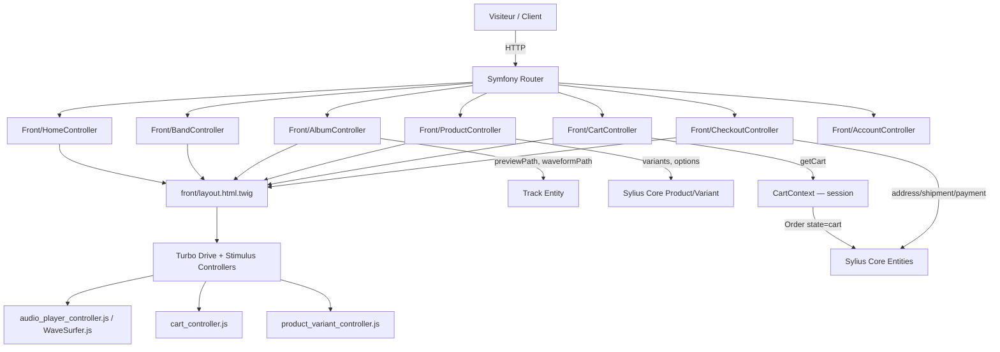

# Requirements

## Overview & Goals

Mettre en place la partie **front boutique** (côté visiteur/client) de l'**Indie Label Shop**, une plateforme e-commerce pour labels indépendants. Le back est complet (Symfony 7.4, Sylius Core 2.2, entités musicales et e-commerce). L'objectif est de créer une expérience utilisateur soignée qui valorise le catalogue musical (artistes, albums, tracklists, previews audio) et implémente un tunnel d'achat custom s'appuyant uniquement sur le cœur Sylius (`sylius/core`).

---

## Scope

### In Scope
- **Accueil** : mise en avant éditoriale (nouveautés, artistes, albums en vedette)
- **Catalogue musical** : listing albums/releases avec filtres
- **Page Artiste (Band)** : biographie, membres, réseaux sociaux, discographie
- **Page Album** : artwork, tracklist avec lecteur de preview audio (waveform), releases physiques liées
- **Boutique Merch** : listing produits, fiche produit (options/variants Sylius)
- **Panier & Checkout** : tunnel d'achat custom (panier, adresses, livraison, paiement) basé sur les entités Sylius Core (`Order`, `OrderItem`, `Shipment`, `Payment`)
- **Compte client** : inscription, connexion, historique commandes
- **Composants transversaux** : header, footer, navigation, breadcrumb, pagination

### Out of Scope
- Interface d'administration (déjà réalisée via Aropixel Admin Bundle)
- Encodage audio / gestion des fichiers masters (déjà géré côté back)
- Internationalisation complète (i18n peut être introduit progressivement)
- SyliusShopBundle et ses routes/templates (non installé)

---

## User Stories

 ID | En tant que... | Je veux... | Pour... |
----|---------------|-----------|--------|
 US-01 | Visiteur | Découvrir les nouveaux albums sur la page d'accueil | Rester informé des sorties du label |
 US-02 | Visiteur | Naviguer vers la page d'un artiste | Découvrir sa bio, ses membres et sa discographie |
 US-03 | Visiteur | Écouter un extrait de chaque titre sur la page album | Décider d'acheter avant d'écouter |
 US-04 | Visiteur | Voir la tracklist d'un album avec la waveform de chaque titre | Explorer visuellement le contenu |
 US-05 | Client | Ajouter un article merch ou un album au panier | Effectuer un achat |
 US-06 | Client | Finaliser une commande (adresse, livraison, paiement) | Recevoir ma commande |
 US-07 | Client | Me connecter et consulter mes commandes passées | Suivre mes achats |

---

## Functional Requirements

### Page d'accueil
- Section "Dernières sorties" (Albums avec `status = online`, triés par `releaseDate` desc)
- Section "Artistes" (carousel ou grille de Bands en ligne)
- Bandeau ou hero éditorial (configurable)

### Catalogue Albums
- Grille/liste d'albums avec artwork, titre, artiste, date de sortie
- Filtre par artiste (Band)
- Pagination (Pagerfanta déjà en dépendance)

### Page Album
- Artwork, titre, numéro de catalogue, date de sortie, description
- Tracklist avec pour chaque piste : titre, durée, lecteur waveform (WaveSurfer.js) si `previewPath` disponible
- Releases physiques liées (vinyl, CD…) avec bouton "Ajouter au panier"
- Albums similaires

### Page Artiste (Band)
- Photo, nom, description
- Réseaux sociaux (Facebook, Twitter, Instagram, Website)
- Membres (Artists)
- Discographie (Albums liés)

### Boutique Merch
- Listing des `Product` de type merch
- Fiche produit : images, description, sélection d'options/variants (taille, couleur…), ajout au panier

### Panier & Checkout
- Résumé du panier (items, quantités, prix)
- Tunnel checkout custom en plusieurs étapes : adresse de livraison, méthode de livraison, paiement
- Page de confirmation de commande
- **Pas de SyliusShopBundle** : tous les controllers, formulaires et templates sont implémentés manuellement

### Compte client
- Pages de connexion / inscription
- Dashboard : historique des commandes, détail d'une commande

---

## Non-Functional Requirements
- **Performance** : lazy loading des images (artwork, photos artiste), chargement différé des lecteurs audio
- **Responsive** : mobile-first, compatible desktop/tablette
- **Accessibilité** : balises sémantiques HTML5, `aria-label` sur les contrôles audio
- **SEO** : balises `<title>`, `<meta description>`, URLs propres via les slugs existants


# Technical Design

## Current Implementation

Le backend est complet :
- **Entités musicales** : `Band`, `Album`, `Release`, `Track`, `Tracklist`, `Artist` avec slugs, statuts (`online`/`offline`), images croppées, traductions Doctrine
- **Entités Sylius Core** : `Product` (merch + album via héritage discriminé), `ProductVariant`, `Order`, `OrderItem`, `Payment`, `Shipment`, `ShippingMethod`, `PaymentMethod`, `Customer` — issues de `sylius/core` uniquement, **SyliusShopBundle non installé**
- **Track** : `previewPath` et `waveformPath` générés par l'encodeur async Messenger
- **Stack front existant** : Twig, Stimulus 3, Turbo 7, Asset Mapper — aucune page publique développée
- **Templates** : seul `base.html.twig` (vide) et les templates `admin/` existent
- **Assets** : `assets/app.js` et `assets/app.css` vides à exploiter
- **Pas de routes shop Sylius** : le tunnel panier/checkout est entièrement custom

---

## Key Decisions

 Décision | Choix | Rationale |
---------|-------|----------|
 Framework CSS | **Tailwind CSS** via `importmap:require` | Utility-first, compatible Asset Mapper, pas de build step |
 Interactivité | **Stimulus 3** (déjà en place) | Contrôleurs légers sur les composants dynamiques |
 Navigation SPA-like | **Turbo Drive** (déjà en place) | Transitions fluides sans rechargement complet |
 Lecteur audio | **WaveSurfer.js** via importmap | Valorise `waveformPath` (JSON peaks) déjà généré |
 Layout des templates | **Twig inheritance** à 3 niveaux : `base.html.twig` → `front/layout.html.twig` → page | Pattern standard Symfony |
 Routage | Contrôleurs Symfony dans `src/Controller/Front/` | Symétrie avec `src/Controller/Admin/` déjà en place |
 Panier/Checkout | Implémentation custom via les entités Sylius Core (`Order`, `OrderItem`, etc.) | SyliusShopBundle non installé — tout est à implémenter |
 Gestion session panier | `CartContext` custom stockant l'`Order` en session | Pas de dépendance aux services shop du bundle |

---

## Proposed Changes

### Nouveaux Controllers (`src/Controller/Front/`)
```
Front/HomeController.php          — Page d'accueil
Front/BandController.php          — Listing + page artiste
Front/AlbumController.php         — Listing + page album
Front/ProductController.php       — Listing merch + fiche produit
Front/CartController.php          — Panier (affichage, ajout, suppression d'items)
Front/CheckoutController.php      — Tunnel d'achat custom (adresse, livraison, paiement, confirmation)
Front/AccountController.php       — Connexion, inscription, compte client
```

### Services custom à créer (`src/`)
```
Service/Cart/CartContext.php        — Récupération/création de l'Order courant (session)
Service/Cart/CartManager.php       — Ajout/retrait d'items, recalcul totaux
Form/Type/CheckoutAddressType.php  — Formulaire étape adresse
Form/Type/CheckoutShipmentType.php — Formulaire étape livraison
Form/Type/CheckoutPaymentType.php  — Formulaire étape paiement
```

### Nouveaux Templates (`templates/front/`)
```
front/layout.html.twig                     — Layout principal (header, footer, nav)
front/partials/
  _header.html.twig
  _footer.html.twig
  _album_card.html.twig
  _band_card.html.twig
  _track_row.html.twig
front/home/index.html.twig
front/band/index.html.twig
front/band/show.html.twig
front/album/index.html.twig
front/album/show.html.twig
front/product/index.html.twig
front/product/show.html.twig
front/cart/index.html.twig
front/checkout/address.html.twig
front/checkout/shipment.html.twig
front/checkout/payment.html.twig
front/checkout/confirm.html.twig
front/account/login.html.twig
front/account/register.html.twig
front/account/dashboard.html.twig
front/account/order_show.html.twig
```

### Nouveaux Stimulus Controllers (`assets/controllers/`)
```
audio_player_controller.js    — WaveSurfer.js, lecture preview, waveform
cart_controller.js            — Ajout au panier (fetch API → CartController::add)
product_variant_controller.js — Sélection de variant (taille, couleur…)
```

### Mise à jour des Assets
- `assets/app.css` : import Tailwind + variables de thème (couleurs label)
- `assets/app.js` : registre des nouveaux contrôleurs Stimulus
- `importmap.php` : ajout de `tailwindcss`, `wavesurfer.js`

---

## Data Models / Contracts

Les entités existantes sont exposées directement via les Controllers Symfony (pas d'API REST séparée).

```php
// BandController::show(string $slug)
// → $band = BandRepository::findOneBySlug($slug) + albums

// AlbumController::show(string $slug)
// → $album = AlbumRepository::findOneBySlug($slug) + tracklists + tracks

// CartContext::getCart(): Order
// → Récupère l'Order en cours depuis la session (id stocké)
// → Crée un nouvel Order si aucun n'existe (state = 'cart')

// CartController::add(Request $request): Response
// → Ajoute un OrderItem à l'Order courant via CartManager
// → Retourne un Turbo Stream ou un redirect

// CheckoutController::address(Request $request): Response
// → Étape 1 : formulaire CheckoutAddressType, sauvegarde adresse sur Order

// CheckoutController::shipment(Request $request): Response
// → Étape 2 : choix ShippingMethod, crée Shipment

// CheckoutController::payment(Request $request): Response
// → Étape 3 : choix PaymentMethod, crée Payment, finalise Order

// AudioPlayerController (Stimulus) attend sur l'élément HTML :
// data-audio-player-preview-url-value  = previewPath
// data-audio-player-waveform-url-value = waveformPath (JSON peaks)
```

---

## Architecture Diagram



---

## File Structure (modifications)

```
application/
  src/
    Controller/Front/
      HomeController.php          [NEW]
      BandController.php          [NEW]
      AlbumController.php         [NEW]
      ProductController.php       [NEW]
      CartController.php          [NEW]
      CheckoutController.php      [NEW]
      AccountController.php       [NEW]
    Service/Cart/
      CartContext.php             [NEW]
      CartManager.php             [NEW]
    Form/Type/
      CheckoutAddressType.php     [NEW]
      CheckoutShipmentType.php    [NEW]
      CheckoutPaymentType.php     [NEW]
  templates/front/
    layout.html.twig              [NEW]
    partials/                     [NEW]
    home/                         [NEW]
    band/                         [NEW]
    album/                        [NEW]
    product/                      [NEW]
    cart/                         [NEW]
    checkout/                     [NEW]
    account/                      [NEW]
  assets/
    app.css                       [UPDATE — Tailwind]
    app.js                        [UPDATE — nouveaux controllers]
    controllers/
      audio_player_controller.js  [NEW]
      cart_controller.js          [NEW]
      product_variant_controller.js [NEW]
  importmap.php                   [UPDATE — tailwindcss, wavesurfer.js]
```


# Testing

## Validation Approach

Chaque page et fonctionnalité interactive sera validée en boîte noire via le navigateur (Turbo Drive actif). Les contrôleurs Symfony peuvent être couverts par des tests fonctionnels PHPUnit (`symfony/browser-kit` déjà en dépendance `require-dev`).

---

## Key Scenarios

 Page | Scénario | Résultat attendu |
------|----------|------------------|
 Accueil | Chargement de `/` | Affiche les albums récents + liste des bands online |
 Catalogue | `/albums` | Grille d'albums paginée, filtre par artiste fonctionnel |
 Page Album | `/album/{slug}` | Artwork, tracklist, bouton play sur chaque piste avec previewPath |
 Page Album | Clic play sur un track | Lecteur WaveSurfer se déploie, waveform visible, audio joue |
 Page Artiste | `/band/{slug}` | Bio, membres, discographie, liens réseaux sociaux |
 Boutique Merch | `/boutique` | Listing produits merch |
 Fiche Produit | `/produit/{slug}` | Sélection de variant, bouton "Ajouter au panier" |
 Panier | Ajout d'un item | Compteur du panier header mis à jour (Turbo Stream ou redirect) |
 Checkout | Étape adresse → livraison → paiement | Commande créée via Sylius Core entities, page de confirmation affichée |
 Compte | Connexion `/connexion` | Redirection vers dashboard, commandes visibles |

---

## Edge Cases

- **Track sans previewPath** : le bouton play ne s'affiche pas (condition Twig)
- **Album sans artwork** : image placeholder affichée
- **Band offline** : non indexé, retourne 404
- **Variant en rupture de stock** : bouton "Ajouter au panier" désactivé
- **Panier vide** : affiche un message + CTA vers le catalogue
- **Utilisateur non connecté accédant au compte** : redirection vers `/connexion`

---

## Test Changes

- Ajout de tests fonctionnels dans `tests/Controller/Front/` pour : `HomeControllerTest`, `BandControllerTest`, `AlbumControllerTest`, `ProductControllerTest`, `CartControllerTest`
- Chaque test vérifie : réponse 200, présence de données clés dans le HTML (titre, artwork, tracklist)
- Les fixtures existantes (`src/DataFixtures/`) seront réutilisées pour alimenter les tests


# Delivery Steps

###   Step 1: Mise en place du layout principal et de la charte Tailwind
Le layout global du front (header, footer, navigation) est opérationnel avec Tailwind CSS intégré via l'Asset Mapper.

- Ajouter `tailwindcss` dans `importmap.php` et configurer le CDN play (ou standalone CLI si besoin)
- Créer `templates/front/layout.html.twig` étendant `base.html.twig` : header avec logo/nav, footer avec liens label
- Créer les partials `templates/front/partials/_header.html.twig` et `_footer.html.twig`
- Mettre à jour `assets/app.css` avec les directives Tailwind et les variables de thème (couleurs label)
- Mettre à jour `assets/app.js` pour enregistrer les futurs contrôleurs Stimulus
- Créer `src/Controller/Front/HomeController.php` avec une action `index()` vide
- Créer `templates/front/home/index.html.twig` étendant le layout (page test de structure)

###   Step 2: Pages catalogue musical : listing albums et page artiste (Band)
Les pages publiques de navigation dans le catalogue musical sont accessibles : listing albums paginé et fiches artistes.

- Créer `src/Controller/Front/BandController.php` avec actions `index()` et `show(string $slug)`, routes `/artistes` et `/artiste/{slug}`
- Créer `src/Controller/Front/AlbumController.php` avec actions `index()` et `show(string $slug)`, routes `/albums` et `/album/{slug}`
- Implémenter les requêtes Doctrine (filtrage `status = online`, tri par `releaseDate`, filtre par Band)
- Créer `templates/front/band/index.html.twig`, `band/show.html.twig`, `album/index.html.twig`
- Créer les partials `front/partials/_album_card.html.twig` et `_band_card.html.twig` (artwork, titre, date, lien)
- Intégrer la pagination Pagerfanta dans le listing albums
- Alimenter la page d'accueil (`front/home/index.html.twig`) avec les dernières sorties et la grille d'artistes

###   Step 3: Page album avec tracklist et lecteur audio WaveSurfer.js
La page album affiche la tracklist complète avec un lecteur audio waveform interactif pour chaque piste disposant d'une preview.

- Créer `templates/front/album/show.html.twig` : artwork, métadonnées, description, albums similaires
- Créer `templates/front/partials/_track_row.html.twig` : titre, durée, bouton play conditionnel (`previewPath` non null)
- Ajouter `wavesurfer.js` dans `importmap.php`
- Créer `assets/controllers/audio_player_controller.js` (Stimulus) :
  - Valeurs : `previewUrlValue`, `waveformUrlValue`
  - `connect()` : instancie WaveSurfer avec les peaks JSON du `waveformPath`
  - Action `play()` / `pause()` liée au bouton
  - Gestion d'un seul lecteur actif à la fois (arrêt des autres)
- Intégrer le contrôleur dans `_track_row.html.twig` via attributs `data-controller`

###   Step 4: Boutique merch, panier custom et sélection de variant
La boutique merch est navigable avec un panier entièrement custom basé sur les entités Sylius Core (sans SyliusShopBundle).

- Créer `src/Controller/Front/ProductController.php` avec actions `index()` et `show(string $slug)`, routes `/boutique` et `/produit/{slug}`
- Créer `templates/front/product/index.html.twig` : grille de produits (image, nom, prix)
- Créer `templates/front/product/show.html.twig` : galerie, description, options/variants
- Créer `src/Service/Cart/CartContext.php` : récupère/crée l'`Order` (state=`cart`) en session
- Créer `src/Service/Cart/CartManager.php` : ajoute/retire des `OrderItem`, recalcule les totaux
- Créer `src/Controller/Front/CartController.php` : actions `index()`, `add()`, `remove()`, `update()`
- Créer `templates/front/cart/index.html.twig` : résumé du panier
- Créer `assets/controllers/product_variant_controller.js` (Stimulus) : mise à jour du prix/stock au changement de variant
- Créer `assets/controllers/cart_controller.js` (Stimulus) : soumission fetch vers `CartController::add`, mise à jour compteur header

###   Step 5: Tunnel checkout custom et espace compte client
Le tunnel d'achat en 3 étapes (adresse → livraison → paiement → confirmation) et l'espace compte client sont fonctionnels, entièrement implémentés sans SyliusShopBundle.

- Créer `src/Controller/Front/CheckoutController.php` avec actions `address()`, `shipment()`, `payment()`, `confirm()`
- Créer les Form Types : `CheckoutAddressType`, `CheckoutShipmentType`, `CheckoutPaymentType` (basés sur les entités Sylius Core)
- Créer les templates `templates/front/checkout/address.html.twig`, `shipment.html.twig`, `payment.html.twig`, `confirm.html.twig`
- Créer `src/Controller/Front/AccountController.php` avec actions `login()`, `register()`, `dashboard()`, `orderShow(int $id)`
- Créer les templates `templates/front/account/login.html.twig`, `register.html.twig`, `dashboard.html.twig`, `order_show.html.twig`
- Configurer le firewall Symfony pour les routes `/compte/*` (accès réservé aux clients connectés)
- Ajouter les tests fonctionnels `tests/Controller/Front/` : `HomeControllerTest`, `BandControllerTest`, `AlbumControllerTest`, `ProductControllerTest`, `CartControllerTest`